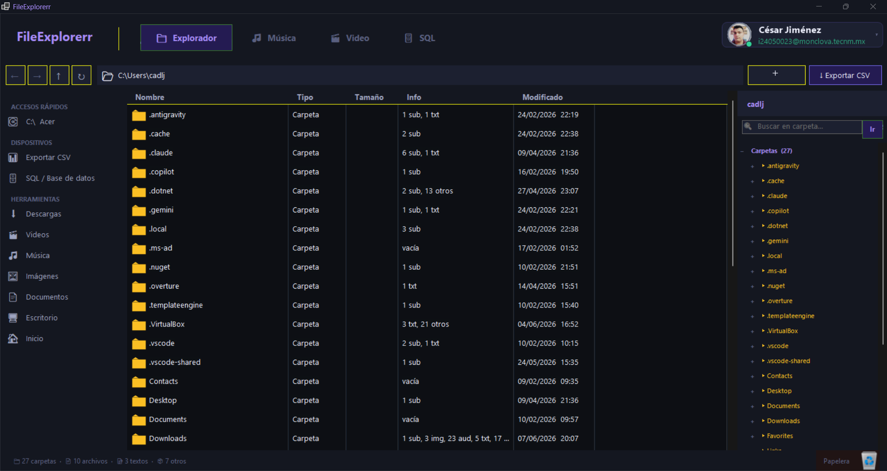
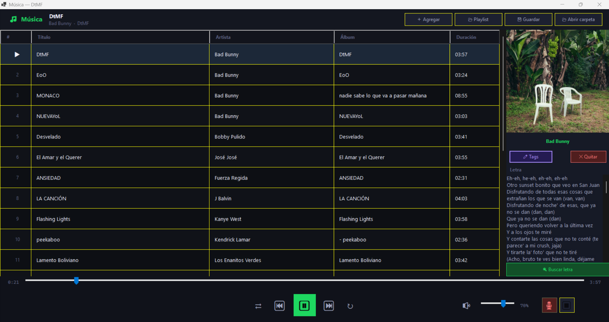
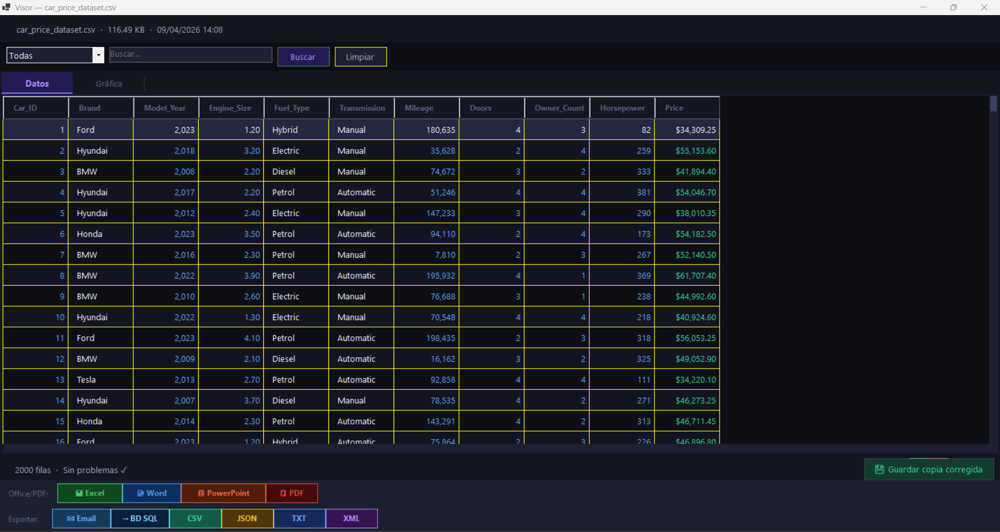
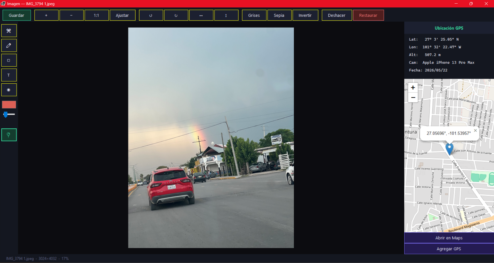
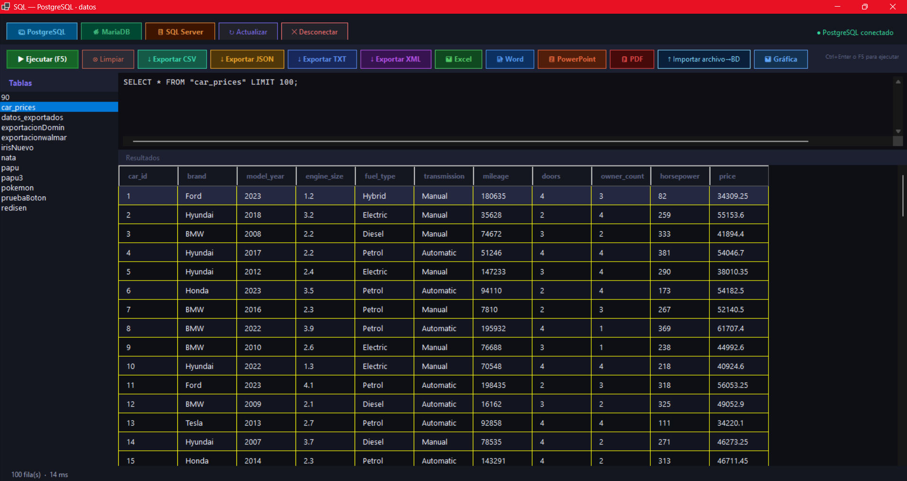
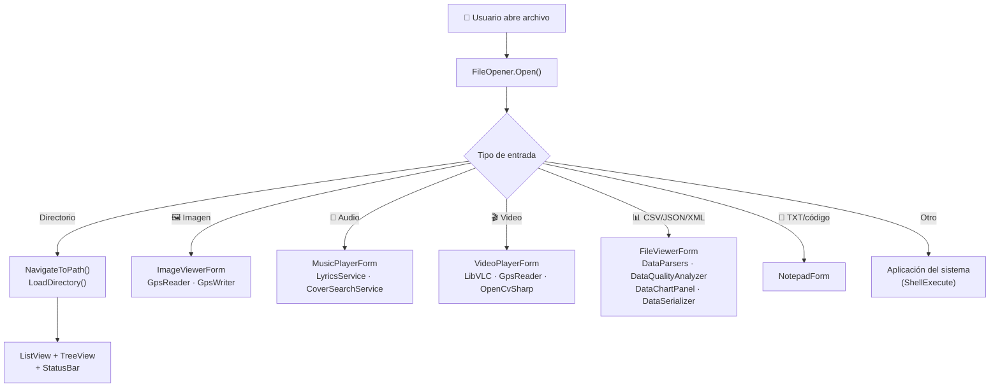

<div align="center">

# 📁 FileExplorerr

**Explorador de archivos de escritorio avanzado para Windows**

[](https://dotnet.microsoft.com/)
[](https://docs.microsoft.com/en-us/dotnet/desktop/winforms/)
[](https://docs.microsoft.com/en-us/dotnet/csharp/)
[](LICENSE.md)
[](https://www.microsoft.com/windows)

Un reemplazo funcional del Explorador de Windows con tema oscuro **Arctic Night**, visualizadores multimedia integrados, análisis inteligente de datos, cliente SQL multi-motor, exportación nativa a Office y PDF, y autenticación OAuth con Google y GitHub.

[⚡ Inicio rápido](#-inicio-rápido) · [✨ Características](#-características) · [🏗️ Arquitectura](#️-arquitectura-del-sistema) · [⚙️ Configuración](#️-configuración) · [🤝 Contribuir](#-contribución)

</div>

---

## 🖼️ Capturas de pantalla

<!-- 
  📸 INSTRUCCIONES:
  1. Crea la carpeta docs/screenshots/ en la raíz del repositorio
  2. Toma las capturas y guárdalas con los nombres indicados
  3. Elimina estos comentarios una vez que hayas agregado las imágenes
-->

### Explorador principal


### Reproductor de música


### Visor y analizador de datos


### Editor de imágenes con GPS


### Cliente SQL


---

## ⚡ Inicio rápido

> **Sin configuración previa.** No necesitas cuentas de OAuth ni ningún archivo extra para probarlo.

```bash
git clone https://github.com/tu-usuario/FileExplorerr.git
cd FileExplorerr
dotnet run --project FileExplorerr/FileExplorerr.csproj
```

Al abrir la app, selecciona **"Continuar como invitado"** — tendrás acceso completo al explorador, multimedia, SQL y exportación. La autenticación con Google/GitHub es opcional y solo agrega sincronización de perfil y avatar.

---

## 🌟 Vista General

FileExplorerr es una aplicación de escritorio Windows construida con **C# 12** y **.NET 8** que reemplaza y extiende al Explorador de Windows nativo. Combina navegación de archivos con un ecosistema completo de herramientas: reproducción multimedia, edición de imágenes con GPS, análisis y visualización de datos estructurados, un cliente SQL multi-motor, y exportación a múltiples formatos de documento.

### ¿Por qué FileExplorerr?

| Característica | Explorador de Windows | FileExplorerr |
|---|:---:|:---:|
| Reproducción de audio/video | ❌ | ✅ Motor LibVLC |
| Edición de imágenes | ❌ | ✅ Con GPS, filtros y herramientas |
| Análisis de datos CSV/JSON/XML | ❌ | ✅ Detección automática de anomalías |
| Cliente SQL | ❌ | ✅ PostgreSQL, MariaDB, SQL Server |
| Exportación a Office/PDF | ❌ | ✅ .xlsx, .docx, .pptx, .pdf |
| Compresión / descompresión | ❌ | ✅ ZIP, 7z, TAR, RAR |
| Autenticación OAuth | ❌ | ✅ Google + GitHub |
| Tema oscuro | Limitado | ✅ Arctic Night completo |
| Gráficas de datos | ❌ | ✅ Columnas, barras, pastel |

---

## 📋 Tabla de contenidos

- [⚡ Inicio rápido](#-inicio-rápido)
- [🌟 Vista general](#-vista-general)
- [✨ Características](#-características)
- [🏗️ Arquitectura del sistema](#️-arquitectura-del-sistema)
- [📂 Estructura del proyecto](#-estructura-del-proyecto)
- [🔧 Módulos principales](#-módulos-principales)
- [🎨 Funcionalidades en detalle](#-funcionalidades-en-detalle)
- [🧩 Diseño y patrones](#-diseño-y-patrones)
- [🛠️ Tecnologías utilizadas](#️-tecnologías-utilizadas)
- [📥 Instalación](#-instalación)
- [⚙️ Configuración](#️-configuración)
- [🚀 Uso](#-uso)
- [⌨️ Atajos de teclado](#️-atajos-de-teclado)
- [⚡ Rendimiento](#-rendimiento-1)
- [🤝 Contribución](#-contribución)
- [📄 Licencia](#-licencia)

---

## ✨ Características

### 🗂 Explorador de Archivos
- Navegación con historial completo (atrás / adelante / subir nivel)
- Barra de dirección editable con **autocompletado inteligente** estilo Arctic Night: menú flotante con subcarpetas coincidentes, navegación con `↓` / `Enter` / `Escape`, sin interferir con navegaciones programáticas
- Actualización con `F5` o botón dedicado
- **Drag & Drop** entre carpetas con resaltado visual del destino
- **Papelera integrada** en la barra de estado para eliminar arrastrando
- Panel lateral derecho con árbol categorizado y **lazy-loading** de subcarpetas
- Búsqueda recursiva asíncrona con cancelación automática
- Barra de estado con desglose por tipo: `📁 carpetas · 📄 archivos · 🖼️ imágenes · 🎵 audios`
- Columna **Info** con resumen de contenido por carpeta
- Exportación de índice CSV asíncrona con progreso en tiempo real
- Nueva carpeta, renombrar y eliminar (a Papelera de Reciclaje) desde el menú contextual con tema oscuro personalizado

### 🎵 Reproductor de Música
- Lista de reproducción con carga automática de toda la carpeta del archivo inicial
- **Shuffle** con orden pre-generado y **3 modos de repetición** (off / lista / pista única) con indicadores visuales distintos
- Seek, volumen y mute con controles estilo Spotify
- Búsqueda automática de **carátulas de álbum** vía iTunes, Last.fm y Spotify (Levenshtein + similitud de palabras)
- Guardado de carátula en el tag ID3 del archivo
- Búsqueda de **letras** vía lrclib.net
- Edición de tags ID3 (título, artista, álbum, año, pista, género)
- **Grabación de micrófono** con NAudio y guardado en WAV
- Drag & Drop a la lista de reproducción · Exportación/importación de playlists `.txt`

### 🎬 Reproductor de Video
- Motor **LibVLC** con inicialización asíncrona (no bloquea el hilo UI)
- Lista de reproducción con Drag & Drop
- **3 modos de bucle** (off / lista / video único) con indicadores visuales claramente distintos
- Velocidades de reproducción: 0.25× a 3×
- Pantalla completa con `F` o botón dedicado
- Extracción de metadatos (resolución, FPS, codec, audio, duración) vía LibVLC
- Panel GPS integrado con mapa Leaflet/OpenStreetMap embebido
- **Grabación de webcam** con OpenCvSharp y guardado en MP4

### 🖼️ Visor y Editor de Imágenes
- Soporte para más de 35 extensiones incluyendo RAW (CR2, NEF, ARW, DNG, etc.)
- Zoom libre (5% – 2000%) con rueda del ratón y pan ilimitado
- Herramientas de dibujo: recorte, pincel, borrador, texto, cuentagotas
- Selector de fuente con preview en tiempo real
- Transformaciones: rotar ±90°, voltear horizontal/vertical
- Filtros no destructivos: escala de grises, sepia, invertir colores
- **Deshacer** hasta 20 estados · restaurar original
- **Panel GPS** con extracción de coordenadas EXIF y mapa embebido
- **Escritura de GPS** en EXIF de JPEG/TIFF de forma atómica (sin corromper el original en caso de fallo)

### 📊 Visor y Analizador de Datos
- Soporte para CSV (RFC 4180), JSON (arrays y objetos anidados), XML, TXT (delimitador automático)
- **Análisis automático de calidad** con detección de: filas duplicadas, fechas a normalizar (→ `yyyy-MM-dd`), teléfonos malformados, emails inválidos, campos vacíos, filas con columnas desajustadas
- Celdas coloreadas por tipo de problema · filtrado en tiempo real · ordenamiento por columna
- **Gráficas interactivas**: columnas, barras horizontales, pastel — con selección de agrupación, métrica (conteo, suma, promedio) y columna de valor
- Guardar copia corregida con todas las sugerencias aplicadas
- Exportación directa a una base de datos SQL abierta

### 🗄️ Cliente SQL
- Conexión a **PostgreSQL**, **MariaDB** y **SQL Server** con soporte de Autenticación de Windows
- Editor SQL con `F5` / `Ctrl+Enter` para ejecutar
- Lista de tablas con doble clic para previsualizar · indicador de tiempo de ejecución
- **Importación** de CSV, JSON, XML, TXT directamente a una tabla
- **Gráfica flotante** del resultado con controles de tipo y métrica
- Exportación de resultados a todos los formatos disponibles

### 📦 Compresión y Descompresión
- **ZIP**: BCL .NET, sin dependencias externas
- **7z, TAR, TAR.GZ, TAR.BZ2**: via SharpCompress
- **RAR**: solo extracción (formato propietario de RarLab)
- Protección **Zip Slip** validada en cada entrada antes de escribir al disco
- Modo "Extraer aquí" (aplana carpeta raíz única, idéntico a WinRAR/7-Zip)
- Ventana de progreso con cancelación, temporizador y nombre del archivo actual

### 📤 Exportación Nativa a Office y PDF
- **Excel (.xlsx)**: ClosedXML — sin límite práctico, filtros automáticos, panel congelado, anchos por muestreo
- **Word (.docx)**: DocumentFormat.OpenXml — hasta 8 000 celdas, landscape automático
- **PowerPoint (.pptx)**: DocumentFormat.OpenXml — hasta 500 filas, portada + diapositivas paginadas, tema Arctic Night
- **PDF (.pdf)**: QuestPDF — paginación automática, orientación automática, hasta 500 000 celdas
- Todos: progreso animado, cancelación cooperativa, archivo parcial eliminado en fallo

### 🔐 Autenticación OAuth
- Login con **Google** (OpenID Connect) y **GitHub** (user:email, read:user)
- Servidor HTTP local en `localhost:5200` para el callback
- Sesión persistida en `AppData/FileExplorerr/session.json` (30 días)
- Avatar cacheado 24 h · Panel flotante estilo VS Code con info de sesión
- **Modo invitado** disponible sin ninguna configuración

---

## 🏗️ Arquitectura del sistema

```
┌──────────────────────────────────────────────────────────────┐
│                         UI Layer                              │
│   Forms · Dialogs · Components · Theme (Arctic Night)         │
│   Form1 · FileViewerForm · ImageViewerForm · MusicPlayerForm  │
│   VideoPlayerForm · NotepadForm · SqlViewerForm               │
├──────────────────────────────────────────────────────────────┤
│                      Services Layer                           │
│   FileOpener · FileOperationService · FileTypeHelper          │
│   ExportadorOffice · CompressionService                       │
├────────────────────┬─────────────────────────────────────────┤
│    Export Layer    │         Compression Layer                │
│  IOfficeExporter   │  IArchiver · ArchiverFactory             │
│  ExportOptions     │  ZipArchiver · SharpCompressArchiver     │
│  ExportResult      │  RarArchiver · ArchiveOptions            │
│  ExcelExporter     │  ArchiveResult                           │
│  WordExporter      │                                          │
│  PowerPointExporter│                                          │
│  PdfExporter       │                                          │
│  OfficeExporterFact│                                          │
├────────────────────┴─────────────────────────────────────────┤
│                       Data Layer                              │
│   DataParsers · DataQualityAnalyzer · DataSerializer          │
│   QualityReport · CsvParseResult · ChartDataBuilder           │
│   DataChartPanel                                              │
├──────────────────────┬───────────────────────────────────────┤
│      Core Layer      │          Media Layer                   │
│  FileExtensions      │  CoverSearcher · CoverSearchService    │
│  FileClassifier      │  CoverSearchResult                     │
│  FileStats           │  GpsReader · GpsWriter · GpsData       │
│  CsvIndexer          │  LyricsService                         │
│  AppHelpers          │                                        │
├──────────────────────┴───────────────────────────────────────┤
│                      Database Layer                           │
│  IDbConnector · PostgreSqlConnector · MariaDbConnector        │
│  SqlServerConnector · SqlConnector (façade) · SqlWriteResult  │
├──────────────────────────────────────────────────────────────┤
│                        Auth Layer                             │
│  UserProfile · SessionManager · OAuthConfig                   │
│  LoginForm · AccountButton · AccountPanel                     │
└──────────────────────────────────────────────────────────────┘
```

### Flujo de datos principal



---

## 📂 Estructura del proyecto

```
FileExplorerr/
│
├── FileExplorerr.csproj          # Proyecto WinForms .NET 8 — dependencias NuGet
├── FileExplorerr.slnx            # Solución Visual Studio
├── Program.cs                    # Punto de entrada STAThread — OAuth, QuestPDF, arranque
├── appsettings.example.json      # Plantilla de credenciales OAuth (nunca subir appsettings.json)
│
├── Auth/                         # Autenticación OAuth y gestión de sesión
│   ├── AccountButton.cs          # Botón de cuenta con avatar y menú flotante
│   ├── AccountPanel.cs           # Panel flotante estilo Visual Studio
│   ├── LoginForm.cs              # Flujo OAuth completo (Google + GitHub)
│   ├── OAuthConfig.cs            # Lector de credenciales desde appsettings.json
│   └── UserProfile.cs            # Modelo de usuario + SessionManager
│
├── Charts/                       # Visualización de datos
│   ├── ChartDataBuilder.cs       # DataTable → datos de gráfica (SRP)
│   └── DataChartPanel.cs         # Control GDI+ — columnas, barras, pastel
│
├── Core/                         # Utilidades transversales
│   ├── AppHelpers.cs             # FileExtensions · FileSize · CsvHelper · BrowserHelper · SmtpConfig
│   ├── CsvIndexer.cs             # Generador de índice CSV recursivo y asíncrono
│   ├── FileClassifier.cs         # Clasificación por extensión → FileStats
│   ├── FileStats.cs              # Contadores con métodos de formateo
│   └── QualityReport.cs          # DTO central del análisis de calidad
│
├── Data/                         # Parsers, análisis y serialización
│   ├── DataParsers.cs            # Parsers stateless: CSV · TXT · JSON · XML → DataTable
│   ├── DataQualityAnalizer.cs    # Análisis O(n): duplicados · fechas · teléfonos · emails
│   └── DatSerializer.cs          # Serialización DataTable → CSV · TSV · JSON · XML
│
├── DataBase/                     # Abstracción de bases de datos
│   ├── IDbConnector.cs           # Interfaz Strategy
│   ├── PostgreSqlConnector.cs    # Npgsql — async, transaccional
│   ├── MariaDbConnector.cs       # MySqlConnector — async, transaccional
│   ├── SqlServerConnector.cs     # Microsoft.Data.SqlClient — async, transaccional
│   ├── SqlConnector.cs           # Façade de compatibilidad legacy
│   └── SqlWriteResult.cs         # DTO de resultado de inserción masiva
│
├── Media/                        # Servicios multimedia y metadatos
│   ├── CoverSearcher.cs          # Multi-fuente: iTunes · Last.fm · Spotify + similitud Levenshtein
│   ├── CoverSearchResult.cs      # DTO de resultado de búsqueda
│   ├── CoverSearchService.cs     # Façade de alto nivel
│   ├── GpsData.cs                # Record inmutable con coordenadas, altitud, cámara, fecha
│   ├── GpsReader.cs              # EXIF (imágenes) + átomos QuickTime (video)
│   ├── GpsWriter.cs              # Escritura GPS en EXIF de JPEG/TIFF (atómica)
│   └── LyricsService.cs          # Letras vía lrclib.net
│
├── Services/
│   ├── Export/                   # Exportadores nativos Office/PDF
│   │   ├── IOfficeExporter.cs    # Contrato Strategy — nunca lanza excepciones
│   │   ├── ExportOptions.cs      # DTO inmutable con builder fluido
│   │   ├── ExportResult.cs       # DTO: Ok / Fail / Cancelled
│   │   ├── OfficeExporterFactory.cs
│   │   ├── ExcelExporter.cs      # ClosedXML
│   │   ├── WordExporter.cs       # DocumentFormat.OpenXml
│   │   ├── PowerPointExporter.cs # DocumentFormat.OpenXml
│   │   └── PdfExporter.cs        # QuestPDF
│   │
│   ├── Compression/              # Compresión y descompresión
│   │   ├── IArchiver.cs          # Contrato Strategy
│   │   ├── ArchiveOptions.cs     # DTO inmutable con builder fluido
│   │   ├── ArchiveResult.cs      # DTO: CompressOk · ExtractOk · Fail · Cancelled
│   │   ├── ArchiverFactory.cs
│   │   ├── ZipArchiver.cs        # BCL .NET — Zip Slip prevention
│   │   ├── SharpCompressArchiver.cs # 7z · TAR · TAR.GZ · TAR.BZ2
│   │   └── RarArchiver.cs        # Solo extracción
│   │
│   ├── ExportadorOffice.cs       # Façade público con diálogos de UI
│   ├── FileOpener.cs             # Enrutador de apertura al visor correcto
│   ├── FileOperationService.cs   # Crear · renombrar · eliminar · mover (DnD)
│   ├── FileTypeHelper.cs         # Etiquetas legibles + columna Info
│   └── CompressionService.cs     # Façade público con diálogos de UI
│
└── UI/
    ├── Components/
    │   ├── FileIconFactory.cs    # Iconos GDI+ 32×32 programáticos
    │   ├── MinimalMenuRenderer.cs # ContextMenu con tema Arctic Night
    │   └── Theme.cs              # Sistema de diseño completo: colores, fuentes, factory methods
    │
    ├── Dialogs/
    │   ├── CompressionProgressForm.cs
    │   ├── ConexionDialog.cs
    │   ├── EmailForm.cs
    │   ├── ExportProgressForm.cs
    │   ├── ExtractOptionsDialog.cs
    │   ├── GpsEditDialog.cs
    │   ├── InputDialog.cs
    │   ├── NombreTablaDialog.cs
    │   ├── TagEditDialog.cs
    │   └── TextToolDialog.cs
    │
    └── Forms/
        ├── Form1.cs              # Ventana principal — navegación, ListView, TreeView, DnD
        ├── FilePropertiesForm.cs
        ├── FileViewerform.cs     # Visor de datos + gráficas + exportación
        ├── ImagevIewerform.cs    # Editor de imágenes + GPS
        ├── MusicPlayerForm.cs    # Reproductor + grabación + letras
        ├── NotepadForm.cs        # Bloc de notas avanzado
        ├── SqlViewerForm.cs      # Cliente SQL multi-motor
        └── VideoPlayerForm.cs    # Reproductor + webcam + GPS
```

---

## 🔧 Módulos principales

### `Core/AppHelpers.cs` — Utilidades centralizadas

Fuente única de verdad para helpers compartidos entre todos los formularios:

| Clase | Responsabilidad |
|---|---|
| `FileExtensions` | Sets de extensiones por categoría (Image, Audio, Video, Text, Document, Archive) |
| `FileSize` | Formateo de bytes a formato legible (B → TB) |
| `TimeSpanFormat` | Formateo de duraciones (`1:23:45` o `3:07`) |
| `CsvHelper` | Split RFC 4180, escape de campos, split de líneas |
| `BrowserHelper` | Registro IE-Edge para WebBrowser (mapas GPS) |
| `SmtpConfig` | Carga y persistencia de configuración SMTP en AppData |

### `Data/DataQualityAnalyzer.cs` — Análisis de calidad

Detecta seis tipos de problemas en un único recorrido **O(n)** sobre las filas:

1. **Duplicados** — hashing de filas completas con `Dictionary<string, int>`
2. **Fechas** — detecta `dd/mm/yyyy`, `mm/dd/yyyy`, `yyyy.mm.dd` → normaliza a ISO 8601
3. **Campos vacíos** — null o whitespace
4. **Teléfonos** — heurística: nombre de columna + ≥ 60% de valores con patrón de teléfono
5. **Emails** — validación estructural: `@`, dominio con punto, TLD ≥ 2 caracteres
6. **Mismatches CSV** — columnas desajustadas, detectadas en el parser y propagadas al informe

### `Services/Export/` — Exportadores nativos

Todos implementan `IOfficeExporter`. Reglas invariantes: **nunca lanzan excepciones**, reportan progreso 0–100, respetan `CancellationToken` y eliminan el archivo parcial si fallan.

| Exportador | Límite | Características especiales |
|---|---|---|
| `ExcelExporter` | 1 048 575 filas | Filtros automáticos, panel congelado, anchos por muestreo de 300 filas |
| `WordExporter` | 8 000 celdas, 20 col | Landscape automático para tablas anchas |
| `PowerPointExporter` | 500 filas, 20 col, 18/diap | Portada con metadatos + diapositivas paginadas con tema Arctic Night |
| `PdfExporter` | 500 000 celdas | Timer de animación paralelo (QuestPDF es síncrono) |

### `Services/Compression/` — Archivers

Todos implementan `IArchiver`. Validan **path traversal (Zip Slip) en cada entrada** antes de escribir. Soportan `FlattenSingleRootFolder` (comportamiento "Extraer aquí" de WinRAR/7-Zip).

### `Media/CoverSearcher.cs` — Algoritmo de similitud

```
score = artista × 0.35  +  título × 0.50  +  palabras × 0.15

donde:
  artista, título  =  Levenshtein normalizado con potencia 0.8
  palabras         =  coincidencia de tokens > 2 caracteres entre fuentes
```

La normalización elimina diacríticos, stopwords musicales (`feat.`, `remix`, `official`…) y contenido entre paréntesis/corchetes antes de comparar.

---

## 🎨 Funcionalidades en detalle

### Autocompletado de la barra de dirección

Implementado como un `ListBox` flotante propio (no el autocompletado nativo de Windows) para mantener el tema Arctic Night. Puntos clave:

- Se activa con `TextChanged` solo cuando la ruta contiene al menos una `\`
- Filtra subcarpetas en tiempo real con `Path.GetDirectoryName()` + comparación case-insensitive
- Se posiciona debajo de la barra usando coordenadas de pantalla
- Navegación: `↓` mueve el foco al ListBox, `Enter` acepta, `Escape` cierra sin navegar
- Protección contra bucles: desuscribe `TextChanged` durante navegaciones programáticas (historial, botones, favoritos) para que el menú no aparezca

### Panel GPS

**Lectura:**
- Imágenes: EXIF vía `System.Drawing.PropertyItem` (tags `0x0001`–`0x001D`)
- Videos MP4/MOV: átomos QuickTime `©xyz` → `loci` → scan ISO 6709 en los primeros 50 MB

**Escritura** (solo JPEG/TIFF):
- Crea `.tmp_gps` → escribe EXIF → elimina original → renombra temporal
- Si falla en cualquier paso, el original queda intacto

**Mapa:**
- HTML embebido con Leaflet.js + OpenStreetMap en `WebBrowser`
- Emulación IE-Edge vía registro de Windows para renderizado moderno de Leaflet

### Gráficas GDI+ (`DataChartPanel`)

Control personalizado sin dependencias externas que implementa:

- **Columnas**: barras verticales con degradado, etiquetas rotadas 45°, grid horizontal
- **Barras**: barras horizontales con etiquetas truncadas automáticamente, grid vertical
- **Pastel**: sectores con porcentaje embebido (> 12°), leyenda lateral

Todos los tipos usan la paleta Arctic Night (10 colores) y ajustan sus márgenes dinámicamente al ancho de las etiquetas.

---

## 🧩 Diseño y patrones

### Strategy

```csharp
// Exportación — resolución por extensión en tiempo de ejecución
IOfficeExporter exporter = OfficeExporterFactory.Resolve(".xlsx");
ExportResult result = await exporter.ExportAsync(data, options, progress);

// Compresión
IArchiver archiver = ArchiverFactory.Resolve(".zip");
ArchiveResult result = await archiver.CompressAsync(options, progress);

// Base de datos
IDbConnector connector = new PostgreSqlConnector(connectionString);
var (dt, rows) = await connector.ExecuteAsync(sql);
```

### Factory + registro en startup

Agregar soporte para un nuevo formato requiere **una sola línea** en `Program.cs`:

```csharp
OfficeExporterFactory.Register(new CsvExporter());   // ejemplo futuro
ArchiverFactory.Register(new SevenZipArchiver());     // ejemplo futuro
```

### Fluent Builder con DTOs inmutables

```csharp
var opts = ExportOptions.For(outputPath, "Mi título")
                        .WithMaxRows(5_000)
                        .WithTimestamp(true)
                        .WithCancellation(cts.Token)
                        .Build();

var archiveOpts = ArchiveOptions
    .ForExtraction(archivePath, destination)
    .WithOverwrite(false)
    .WithFlattenSingleRoot()
    .WithCancellation(cts.Token)
    .Build();
```

### Result Object — patrón no-throw

Los exportadores y archivers **nunca lanzan excepciones**. El caller inspecciona el resultado:

```csharp
ExportResult result = await exporter.ExportAsync(data, options, progress);

if (result.Success)           { OpenFile(result.OutputPath); }
else if (result.WasTruncated) { ShowWarning($"Truncado a {result.RowsWritten} filas"); }
else if (result.WasCancelled) { /* no hacer nada */ }
else                          { MessageBox.Show(result.ErrorMessage); }
```

### Async con cancelación cooperativa

Cada operación pesada cancela la anterior al iniciarse una nueva:

```csharp
_loadCts.Cancel();
_loadCts = new CancellationTokenSource();
var token = _loadCts.Token;

var result = await Task.Run(() => HeavyWork(token), token);
if (token.IsCancellationRequested) return;
```

---

## 🛠️ Tecnologías utilizadas

### Plataforma y lenguaje

| | Versión | Uso |
|---|---|---|
| C# | 12 | Lenguaje principal |
| .NET | 8.0 (Windows) | Runtime y BCL |
| Windows Forms | .NET 8 | Framework de UI |

### Multimedia

| Paquete | Versión | Uso |
|---|---|---|
| `LibVLCSharp` + `VideoLAN.LibVLC.Windows` | 3.9.x / 3.0.21 | Motor de video |
| `OpenCvSharp4` + `.Extensions` + `.runtime.win` | 4.13.0+ | Captura y grabación de webcam |
| `NAudio` | 2.2.1 | Audio PCM y grabación de micrófono |
| `taglib-sharp-netstandard2.0` | 2.1.0 | Tags ID3, Vorbis, APE, M4A |

### Exportación de documentos

| Paquete | Versión | Uso |
|---|---|---|
| `ClosedXML` | 0.102.2 | Excel (.xlsx) |
| `DocumentFormat.OpenXml` | 2.20.0 | Word (.docx) y PowerPoint (.pptx) |
| `QuestPDF` | 2024.12.0 | PDF — licencia Community MIT |

### Compresión

| Paquete | Versión | Uso |
|---|---|---|
| `SharpCompress` | 0.49.1 | 7z, TAR, TAR.GZ, TAR.BZ2, RAR (extracción) |
| `System.IO.Compression` | BCL | ZIP — sin dependencias externas |

### Bases de datos

| Paquete | Versión | Uso |
|---|---|---|
| `Npgsql` | 9.0.2 | PostgreSQL async (ADO.NET) |
| `MySqlConnector` | 2.3.7 | MariaDB/MySQL async (ADO.NET) |
| `Microsoft.Data.SqlClient` | 5.2.2 | SQL Server async (ADO.NET) |

### APIs externas opcionales

| API | Uso | Clave requerida |
|---|---|:---:|
| iTunes Search API | Carátulas de álbumes | No |
| lrclib.net | Letras de canciones | No |
| Last.fm API | Carátulas alternativas | No |
| Spotify API | Carátulas alternativas (best-effort) | No |
| OpenStreetMap / Leaflet.js | Mapas GPS embebidos | No |
| Google OAuth 2.0 | Autenticación de usuario | Sí |
| GitHub OAuth | Autenticación de usuario | Sí |

### P/Invoke y APIs de Windows

| API | Uso |
|---|---|
| `SHFileOperation` | Envío a Papelera de Reciclaje |
| `DwmSetWindowAttribute` | Barra de título oscura y color de acento |
| `ExtractIcon` | Ícono de papelera desde shell32.dll |

---

## 📥 Instalación

### Requisitos

- **SO**: Windows 10 / 11 (x64)
- **Runtime**: [.NET 8.0 Desktop Runtime](https://dotnet.microsoft.com/en-us/download/dotnet/8.0)
- **IDE** (para compilar): Visual Studio 2022 v17.8+ o VS Code con C# Dev Kit

### Pasos

```bash
# 1. Clonar
git clone https://github.com/tu-usuario/FileExplorerr.git
cd FileExplorerr

# 2. Restaurar dependencias NuGet
dotnet restore

# 3. Compilar
dotnet build                    # Debug
dotnet build -c Release         # Release optimizado

# 4. Ejecutar
dotnet run --project FileExplorerr/FileExplorerr.csproj
```

También puedes abrir `FileExplorerr.slnx` en Visual Studio y presionar `F5`.

---

## ⚙️ Configuración

### OAuth — Google y GitHub (opcional)

> ⚠️ **Seguridad**: `appsettings.json` está en `.gitignore` y **nunca debe subirse al repositorio**. Los Client Secrets son equivalentes a contraseñas. Si los expones accidentalmente en un commit, **revócalos de inmediato** en [Google Cloud Console](https://console.cloud.google.com) o [GitHub Settings](https://github.com/settings/developers).

```bash
cp FileExplorerr/appsettings.example.json FileExplorerr/appsettings.json
```

```json
{
  "OAuth": {
    "Google": {
      "ClientId": "TU_GOOGLE_CLIENT_ID",
      "ClientSecret": "TU_GOOGLE_CLIENT_SECRET"
    },
    "GitHub": {
      "ClientId": "TU_GITHUB_CLIENT_ID",
      "ClientSecret": "TU_GITHUB_CLIENT_SECRET"
    }
  }
}
```

**Para obtener credenciales de Google:**
1. [Google Cloud Console](https://console.cloud.google.com/) → Nuevo proyecto
2. Habilita la **Google OAuth 2.0 API**
3. Crea credenciales tipo "Aplicación de escritorio"
4. Agrega `http://localhost:5200/callback` como URI de redirección autorizado

**Para obtener credenciales de GitHub:**
1. [GitHub Developer Settings](https://github.com/settings/developers) → Nueva OAuth App
2. Establece `http://localhost:5200/callback` como Authorization callback URL

> Si no configuras OAuth, usa **"Continuar como invitado"** en la pantalla de login para acceso completo sin autenticación.

### SMTP para envío de emails (opcional)

Configura desde dentro de la app: abre cualquier archivo → botón **✉ Email** → **⚙ Configurar SMTP**. La configuración se guarda en `AppData\Roaming\FileExplorerr\smtp.cfg`.

Para Gmail necesitas una [Contraseña de Aplicación](https://support.google.com/accounts/answer/185833) de 16 caracteres (no tu contraseña normal).

---

## 🚀 Uso

### Apertura de archivos

| Tipo | Acción | Resultado |
|---|---|---|
| Imagen (JPG, PNG, RAW…) | Doble clic | `ImageViewerForm` |
| Audio (MP3, FLAC…) | Doble clic | `MusicPlayerForm` con toda la carpeta |
| Video (MP4, MKV…) | Doble clic | `VideoPlayerForm` |
| CSV, JSON, XML | Doble clic | `FileViewerForm` con análisis automático |
| TXT, LOG | Doble clic | Diálogo: visor de tabla o bloc de notas |
| Código fuente (CS, PY…) | Doble clic | `NotepadForm` |
| ZIP, RAR, 7z | Clic derecho | Opciones de compresión/extracción |
| Cualquier otro | Doble clic | Aplicación predeterminada del sistema |

### Visor de datos — flujo de trabajo

```
1. Abre un archivo CSV / JSON / XML
2. El análisis de calidad se ejecuta automáticamente en segundo plano
3. Un popup resume los problemas detectados
4. Las celdas afectadas aparecen coloreadas:
     🔴 Duplicados  🟡 Vacíos  🔵 Fechas  🟣 Teléfonos  🟠 Emails
5. Filtra, busca o reordena los datos según necesites
6. Pestaña "Gráfica" → elige agrupación, métrica y tipo de gráfica
7. Exporta al formato deseado (CSV, Excel, PDF, etc.)
   — o guarda una "copia corregida" con todas las sugerencias aplicadas
```

### Menú contextual del explorador

```
Abrir                        → visor correspondiente
Nueva carpeta
Renombrar
Eliminar                     → envía a Papelera de Reciclaje
Propiedades                  → panel detallado con metadatos
Actualizar  (F5)
─────────────────────────────
📦 Comprimir selección...    → crea ZIP, 7z, TAR, etc.
📂 Extraer aquí              → solo archivos de compresión
📁 Extraer en...             → solo archivos de compresión
```

---

## ⌨️ Atajos de teclado

### Explorador principal

| Atajo | Acción |
|---|---|
| `F5` | Actualizar directorio |
| `Enter` en barra de dirección | Navegar a la ruta escrita |
| `↓` desde la barra | Mover foco al menú de autocompletado |
| `Enter` en autocompletado | Aceptar sugerencia |
| `Escape` en autocompletado | Cerrar menú |

### Visor de imágenes

| Atajo | Acción |
|---|---|
| `+` / `−` | Zoom in / Zoom out |
| Rueda del ratón | Zoom in / Zoom out |
| `Ctrl+Z` | Deshacer |
| `Ctrl+S` | Guardar copia |
| `Escape` | Deseleccionar herramienta / Cerrar |

### Reproductor de música

| Atajo | Acción |
|---|---|
| `Espacio` | Play / Pausa |
| `←` / `→` | Retroceder / Avanzar 5 s |
| `↑` / `↓` | Subir / Bajar volumen 5% |

### Reproductor de video

| Atajo | Acción |
|---|---|
| `Espacio` | Play / Pausa |
| `←` / `→` | Retroceder / Avanzar 10 s |
| `↑` / `↓` | Subir / Bajar volumen 5% |
| `M` | Silenciar / Activar audio |
| `F` | Pantalla completa / Ventana |
| `Escape` | Salir de pantalla completa |

### Bloc de notas

| Atajo | Acción |
|---|---|
| `Ctrl+S` | Guardar |
| `Ctrl+Shift+S` | Guardar como |
| `Ctrl+F` | Buscar |
| `Ctrl+H` | Reemplazar |
| `Ctrl+G` | Ir a línea |
| `F3` | Siguiente coincidencia |
| `Ctrl++` / `Ctrl+−` | Zoom de fuente |
| `Escape` | Cerrar panel de búsqueda |

### Visor SQL

| Atajo | Acción |
|---|---|
| `F5` | Ejecutar consulta |
| `Ctrl+Enter` | Ejecutar consulta |

---

## ⚡ Rendimiento

| Área | Estrategia |
|---|---|
| Carga de directorios | `Task.Run` + semáforo de 8 tareas paralelas para info de carpetas · `CancellationTokenSource` por navegación · `BeginUpdate/EndUpdate` en ListView |
| Análisis de calidad | Parser y analizador stateless en background · detección de duplicados con `Dictionary` (hashing directo) |
| Búsqueda en árbol | `CancellationTokenSource` enlazado: nueva búsqueda cancela automáticamente la anterior |
| Exportación Excel | Cancelación cooperativa cada 3 000 filas |
| Exportación PDF | Timer de animación paralelo (QuestPDF no soporta progreso nativo) |
| Todos los exportadores | Archivo parcial eliminado en caso de fallo o cancelación |

---

## 🤝 Contribución

### Primeros pasos

```bash
# Fork del repositorio en GitHub, luego:
git clone https://github.com/TU-USUARIO/FileExplorerr.git
cd FileExplorerr

# Copia las credenciales de ejemplo (requerido para compilar)
cp FileExplorerr/appsettings.example.json FileExplorerr/appsettings.json

# Verifica que compila y arranca
dotnet run --project FileExplorerr/FileExplorerr.csproj
```

### Convenciones del proyecto

- **Nombres**: PascalCase para clases y métodos, camelCase para variables locales y campos privados
- **Async**: todo acceso a disco o red debe ser `async Task<>` con `CancellationToken`
- **Exportadores/Archivers**: nunca lanzar excepciones — usar el patrón Result Object
- **Single Responsibility**: una clase, una responsabilidad; sin duplicación de lógica entre formularios
- **Dependencias**: la dirección es `UI → Services → Core`, nunca al revés

### Cómo extender el proyecto

**Nuevo formato de exportación:**
1. Crea `MiExporter : IOfficeExporter` en `Services/Export/`
2. Agrega `OfficeExporterFactory.Register(new MiExporter())` en `Program.cs`
3. Eso es todo — el factory, los botones de UI y el sistema de progreso lo detectan automáticamente

**Nuevo formato de compresión:**
1. Crea `MiArchiver : IArchiver` en `Services/Compression/`
2. Agrega `ArchiverFactory.Register(new MiArchiver())` en `Program.cs`

### Reportar bugs

Abre un issue en [github.com/tu-usuario/FileExplorerr/issues](https://github.com/tu-usuario/FileExplorerr/issues) con:
- Descripción del problema y pasos para reproducirlo
- Versión de Windows y .NET (`dotnet --version`)
- Captura de pantalla o mensaje de error si aplica

---

## 📄 Licencia

Este proyecto está bajo la **licencia MIT**. Consulta [LICENSE.md](LICENSE.md) para más detalles.

Las dependencias incluidas tienen sus propias licencias:

| Paquete | Licencia |
|---|---|
| QuestPDF | Community MIT (libre para ingresos < $1M USD/año) |
| LibVLC / LibVLCSharp | LGPL 2.1 |
| SharpCompress | MIT |
| ClosedXML | MIT |
| DocumentFormat.OpenXml | MIT |
| NAudio | MIT |
| Npgsql | PostgreSQL License (MIT-compatible) |
| MySqlConnector | MIT |
| Microsoft.Data.SqlClient | MIT |
| OpenCvSharp4 | Apache 2.0 |
| taglib-sharp | LGPL 2.1 |

---

<div align="center">

</div>